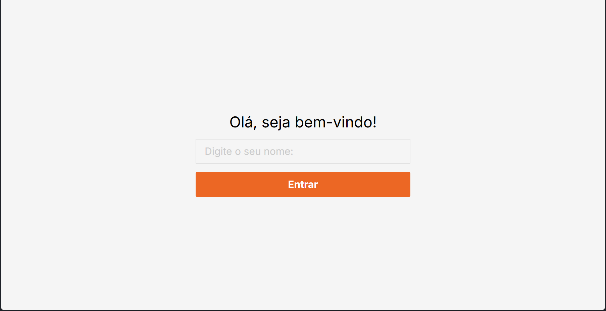

# Customer Management System

This is a simple customer management system that allows you to add, delete, update and view customers. It is built using Next.js, NestJS, TypeORM and PostgreSQL.

## Installation

1. Clone the repository
2. Create a `.env` file in the root directory and add the contents of the `.env.example` file. Replace the values with your own.
3. Run `docker compose up` to start the services. This will start the PostgreSQL database, the NestJS server and the Next.js server.
4. Navigate to `http://localhost:8000` in your browser to view the application.